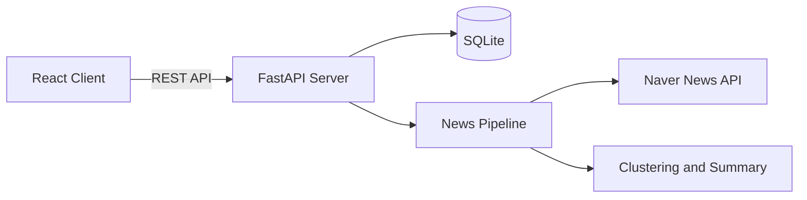

# STRING TIME NEWS

> AI로 군집화·요약된 뉴스를 한눈에 탐색하는 뉴스 대시보드

팀 프로젝트로 제작한 실시간 뉴스 요약 서비스입니다. 여러 언론사의 기사를 이슈 단위로 묶고 요약해, 사용자가 주요 뉴스를 빠르게 파악할 수 있도록 구성했습니다.

[Live Demo](https://project-2-omega-seven.vercel.app) · [GitHub Repository](https://github.com/som1104/string-time-news)

> 현재 공개 데모는 2026년 7월 15일에 수집된 데이터를 기준으로 제공됩니다. Render 무료 인스턴스가 정지된 경우 첫 요청에 시간이 걸릴 수 있습니다.

## 프로젝트 개요

뉴스를 일일이 비교해야 하는 불편을 줄이기 위해 같은 사건을 다룬 기사들을 군집화하고, 핵심 내용을 요약해 보여주는 서비스를 만들었습니다.

- 데일리 핵심 뉴스 TOP 10
- 실시간 트렌드 및 핫이슈 탐색
- 키워드 검색과 카테고리·날짜 필터
- 비로그인 사용자와 로그인 사용자를 구분한 즐겨찾기
- 닉네임 기반 간편 로그인

## 담당 역할

**Frontend Development · UI/UX · API Integration**

React를 활용해 로그인, 홈, 상세 화면과 공용 컴포넌트를 구현하고 FastAPI 백엔드와 연동했습니다. 협업 과정에서 변경되는 API 응답과 사용자 상태를 안정적으로 처리하는 데 중점을 두었습니다.

| 영역 | 담당 내용 |
| --- | --- |
| 화면 구현 | 로그인, 홈, 상세 페이지와 뉴스 카드·트렌드·카테고리 UI 구현 |
| API 연동 | 뉴스, 데일리 요약, 검색, 즐겨찾기 API 연결 |
| 상태 관리 | 로그인 여부에 따른 로컬·서버 즐겨찾기 분리 및 동기화 |
| 데이터 처리 | 서로 다른 형태의 요약·카테고리 응답을 화면용 데이터로 정규화 |
| 컴포넌트 설계 | Header, NewsCard, CategoryBadges 등 공용 컴포넌트 분리 |
| 배포 환경 | 환경변수를 활용해 로컬·터널·배포 API 주소를 분리 |

## 주요 화면

### Login

비밀번호 없이 닉네임만으로 시작할 수 있습니다. 로그인하지 않고 먼저 둘러보는 것도 가능하며, 로그인 사용자의 즐겨찾기는 서버 데이터와 동기화됩니다.

### Home

매일 생성된 핵심 뉴스 10개를 카드 캐러셀로 보여줍니다. 여러 기사에서 추출한 주요 이슈를 짧은 시간 안에 훑어볼 수 있도록 구성했습니다.

### Detail

검색, 트렌드 키워드, 실시간 핫이슈, 카테고리별 뉴스와 날짜 필터를 한 화면에서 제공합니다.

## 문제 해결

### 1. 변경되는 API 응답에 대응

개발 과정에서 데일리 요약의 `summary` 필드가 문자열, 육하원칙 객체, `{ summary, keyword }` 객체로 변경되었습니다. 특정 형태만 가정하면 화면 전체가 깨질 수 있어 세 가지 응답을 모두 인식하는 방어적 파싱 로직을 구현했습니다.

### 2. 로컬과 서버 즐겨찾기 동기화

비로그인 사용자는 브라우저의 로컬 스토리지를 사용하고, 로그인 사용자는 서버 데이터를 사용하도록 분리했습니다. DB ID가 없는 임시 뉴스 카드는 서버 동기화 대상에서 제외해 잘못된 데이터가 저장되지 않도록 처리했습니다.

### 3. 멀티라벨 카테고리 정규화

백엔드가 카테고리를 `"경제|IT/과학"` 문자열 또는 배열로 반환해도 동일한 UI를 그릴 수 있도록 `normalizeCategories` 유틸과 `CategoryBadges` 컴포넌트에서 데이터를 정규화했습니다.

### 4. 카드 클릭과 즐겨찾기 이벤트 충돌 방지

뉴스 카드 전체 클릭과 별표 버튼 클릭이 동시에 실행되지 않도록 이벤트 버블링을 제어했습니다. 키보드 포커스와 `aria-label`도 적용해 기본적인 접근성을 보완했습니다.

## 기술 스택

### Frontend

- React 19
- Vite 8
- React Router 7
- Tailwind CSS 4
- Styled Components
- Lucide React

### Backend · Data

> 아래 영역은 팀 협업으로 구현했습니다.

- FastAPI
- SQLite
- scikit-learn · Sentence Transformers
- Ollama
- Naver News API
- OpenWeather API

## 서비스 구조



## 폴더 구조

```text
string-time-news/
├─ frontend/
│  ├─ public/
│  └─ src/
│     ├─ assets/
│     ├─ components/
│     ├─ pages/
│     └─ utils/
└─ backend/
   ├─ database/
   ├─ utils/
   ├─ main.py
   ├─ run_pipeline.py
   └─ requirements.txt
```

## 로컬 실행

### 1. 저장소 복제

```bash
git clone https://github.com/som1104/string-time-news.git
cd string-time-news
```

### 2. Backend

```bash
cd backend
python -m venv .venv
```

Windows PowerShell:

```powershell
.venv\Scripts\Activate.ps1
pip install -r requirements.txt
uvicorn main:app --reload
```

### 3. Frontend

새 터미널에서 실행합니다.

```bash
cd frontend
npm install
npm run dev
```

## 환경변수

`frontend/.env`

```env
VITE_API_BASE_URL=http://127.0.0.1:8000
VITE_OPENWEATHER_API_KEY=your_openweather_api_key
```

뉴스 수집 파이프라인을 실행할 경우 `backend/.env`에 다음 값을 설정합니다.

```env
NAVER_CLIENT_ID=your_naver_client_id
NAVER_CLIENT_SECRET=your_naver_client_secret
```

실제 키와 비밀값은 저장소에 커밋하지 않습니다.

## 배포

- Frontend: Vercel
- Backend API: Render
- Database: SQLite

프론트엔드는 `VITE_API_BASE_URL` 환경변수를 우선 사용하며, 이를 통해 코드 수정 없이 로컬과 배포 API 주소를 전환할 수 있습니다.

## 협업 프로젝트 안내

이 프로젝트는 학원 팀 프로젝트로 제작되었습니다. 본 저장소는 개인 포트폴리오 공개와 재배포를 위해 정리한 버전입니다.

- **개인 기여:** 프론트엔드 UI/UX, API 연동, 데이터 정규화, 즐겨찾기 상태 처리, 배포 환경 구성
- **팀 기여:** 뉴스 수집, AI 요약, 군집화·분류 모델, FastAPI 및 데이터베이스 구현

